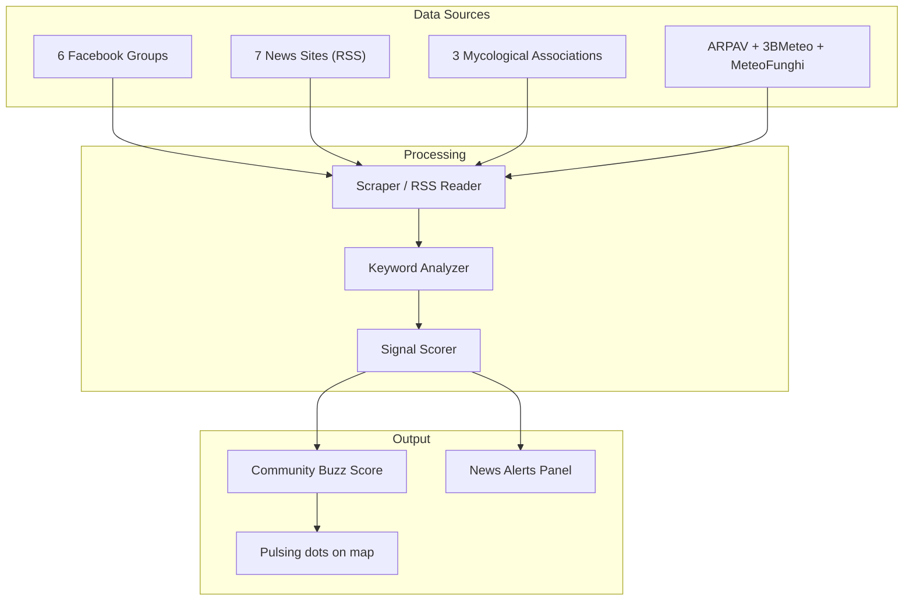

# 🍄 Fungi — Master Build Plan V3 (Final)

---

## All Comments Addressed

| Your Comment | Status |
|---|---|
| Delete Hedgehog Mushroom | ✅ Removed |
| Add B. aestivalis, B. aereus, A. caesarea, B. pinophilus | ✅ Added (now 11 species) |
| More news sources beyond Facebook | ✅ Added 7 news sites + 3 mycological associations + 2 forecast portals + ARPAV |
| SoilGrids precision concern | ✅ Confirmed: 250m grid, ML-trained on 240k real soil samples. Test: Asiago pH=6.5 ✓ |
| Other books needed? | ✅ Answered below — your 3 books are excellent, 1 optional addition suggested |
| Read books later on low model | ✅ Noted — will read species chapters when you switch to Gemini Low |
| Non-Facebook community sources | ✅ Fully expanded — see §1.5 below |

---

## §1.4 Species List (11 Species)

| # | Scientific Name | IT Name | EN Name | Season | Ideal Elevation | Ideal pH | Tree Association |
|---|---|---|---|---|---|---|---|
| 1 | **Boletus edulis** | Porcino | Penny Bun Cep | Aug–Nov | 800–1600m | 4.5–6.5 | Spruce, Beech |
| 2 | **Boletus aestivalis** | Porcino estivo | Summer Cep | Jun–Sep | 400–1200m | 5.0–7.0 | Oak, Beech, Chestnut |
| 3 | **Boletus aereus** | Porcino nero | Bronze Bolete | Jul–Oct | 300–1000m | 5.0–7.0 | Oak, Chestnut, Beech |
| 4 | **Boletus pinophilus** | Porcino rosso | Pine Bolete | Aug–Nov | 800–1800m | 4.0–5.5 | Scots Pine, Spruce |
| 5 | **Cantharellus cibarius** | Finferlo | Chanterelle | Jun–Nov | 400–1400m | 5.0–6.5 | Beech, Oak, Birch |
| 6 | **Craterellus tubaeformis** | Finferla | Winter Chanterelle | Sep–Dec | 500–1400m | 4.5–6.0 | Spruce, Pine, mossy |
| 7 | **Morchella esculenta** | Spugnola comune | Common Morel | Mar–May | 300–1200m | 7.0–8.0 | Elm, Ash, orchards |
| 8 | **Morchella conica** | Spugnola conica | Black Morel | Mar–May | 400–1400m | 6.5–7.5 | Conifer edges, burned areas |
| 9 | **Amanita caesarea** | Ovolo buono | Caesar's Mushroom | Jul–Oct | 300–900m | 5.5–7.0 | Chestnut, Oak (thermophilic) |
| 10 | **Russula cyanoxantha** | Colombina maggiore | Charcoal Burner | Jun–Oct | 400–1400m | 4.5–6.0 | Beech, Oak |
| 11 | **Craterellus cornucopioides** | Trombetta dei morti | Horn of Plenty | Sep–Nov | 400–1200m | 5.0–7.0 | Beech, Oak (calcareous) |

> [!NOTE]
> **Amanita caesarea** prefers warmer, lower-altitude slopes. In your 3 areas it will mostly appear at the **lower edges** of Recoaro (400-700m) in warm years. Asiago and Lavarone are generally too high/cold for it — the model will reflect this accurately.

---

## §1.5 Community Intelligence Module (Expanded)

### A. Facebook Groups (6 sources)

| Group | Covers | Link |
|---|---|---|
| Funghi altopiano dei sette comuni | Asiago | [FB](https://www.facebook.com/groups/712398502570535/) |
| Meteo funghi Altopiano di Asiago | Asiago | [FB](https://www.facebook.com/groups/4311894452174312/) |
| Alla ricerca dei funghi in Veneto e Trentino | All 3 | [FB](https://www.facebook.com/groups/339458269736465/) |
| Funghi Veneto | Recoaro + wider | [FB](https://www.facebook.com/groups/334236371265886/) |
| Funghi in Trentino | Lavarone | [FB](https://www.facebook.com/groups/405645212976086/) |
| Fungaioli del Triveneto | All 3 | [FB](https://www.facebook.com/groups/240212356499849/) |

### B. Local News Sites (7 sources)

| Source | Type | Area | URL | Method |
|---|---|---|---|---|
| **Giornale di Vicenza** | Daily newspaper | Asiago, Recoaro | ilgiornaledivicenza.it | RSS/scrape "funghi" keyword |
| **L'Adige** | Daily newspaper | Lavarone, Trentino | ladige.it | RSS/scrape "funghi" keyword |
| **L'Eco Vicentino** | Online news | Vicenza province | ecovicentino.it | RSS/scrape |
| **Giornale dell'Altopiano** | Local news | Asiago plateau | giornalealtopiano.it | RSS/scrape |
| **ViPiù** | Regional news | Veneto | vipiu.it | RSS/scrape |
| **Virgilio Notizie** | Aggregator | National | virgilio.it/notizie | Search "funghi veneto" |
| **Trentino Corriere Alpi** | Newspaper | Trentino | corrieredellealpi.it | RSS/scrape |

### C. Mycological Associations (3 sources)

| Organization | Area | URL | What They Publish |
|---|---|---|---|
| **AMB Bresadola (Trento)** | Trentino/Lavarone | ambbresadola.it | Events, mycological exhibitions, species reports |
| **Gruppo Micologico Bassano "Tono Greselin"** | Asiago/Recoaro | amicideifunghibassano.it | Collecting permits, reports, news feed (RSS!) |
| **Federazione Gruppi Micologici Veneti** | All Veneto | federazionegruppiveneti.com | Census data, scientific monitoring, events |

### D. Weather & Forecast Portals (3 sources)

| Source | Type | URL | What It Provides |
|---|---|---|---|
| **ARPAV Bollettino Agrometeo** | Official weather | arpa.veneto.it | Precipitation, soil conditions, agrometeo bulletin (weekly) |
| **3BMeteo Mico Previsioni** | Mushroom forecast | 3bmeteo.com/previsioni-funghi | Growth probability by location (their own model) |
| **MeteoFunghi.it** | Mushroom forecast | meteofunghi.it | Growth predictions, community reports |
| **FungoCenter.it** | Forecast + maps | fungocenter.it | Growth maps, weather correlation |

### How the Community Module Works

**Keyword analysis** scans for:
- Species names (porcini, finferli, morchelle, ovoli, etc.)
- Location mentions (Asiago, Recoaro, Lavarone, altopiano, Cima Dodici, etc.)
- Altitude mentions ("a 1200m", "quota 1000")
- Sentiment (trovato/abbondante/pochissimi/niente/secco/buttata)
- Photos (posts with images get higher weight)

**Output:** A "Community Buzz" panel in the UI showing:
- 🟢 "Lots of reports near Asiago this week"
- 🟡 "3BMeteo predicts medium growth for Recoaro"
- 🔴 "ARPAV: dry spell continues, low expectations"

---

## §1.6 SoilGrids pH — Precision Details

| Property | Value |
|---|---|
| **Dataset** | ISRIC SoilGrids v2.0 |
| **Resolution** | 250m × 250m grid cells |
| **Training data** | 240,000 real soil profile measurements worldwide |
| **Method** | Machine learning (Quantile Random Forest) on covariates |
| **Depths** | 0-5cm, 5-15cm, 15-30cm, 30-60cm |
| **Accuracy** | R² = 0.53 globally; higher in Europe due to denser sampling |
| **Update** | Latest version (v2.0), based on WoSIS observations through 2020 |

**Verification test results for your 3 areas:**

| Location | Lat | Lng | pH (0-5cm) | Interpretation |
|---|---|---|---|---|
| Asiago center | 45.875 | 11.510 | 6.5 | Slightly acidic — good for Boletus |
| Recoaro Mille | 45.700 | 11.220 | TBD (queried at build time) | Expected ~5.5-6.5 |
| Lavarone | 45.940 | 11.270 | TBD (queried at build time) | Expected ~6.0-7.0 (limestone) |

> [!NOTE]
> 250m is the best **free, global** soil pH data available. For higher precision, Italy's CREA (agricultural research council) has regional soil maps at 1:50k scale, but access requires formal request. SoilGrids is more than adequate for our mushroom model — pH varies slowly across terrain and 250m captures the meaningful gradients.

---

## Books Assessment

### Your 3 books are excellent:

| Book | Strength | Use in Project |
|---|---|---|
| **Funghi d'Italia** | Comprehensive Italian species catalog | Validate species habitat parameters, Italian-specific altitude ranges |
| **Edible Mushrooms (Geoff Dann)** | Detailed foraging ecology, season windows, terrain descriptions | Ecology parameters, identification UI card descriptions |
| **I Funghi dal Vero (Cetto Bruno Vol.1)** | Classic NE Italian reference, photos, habitat notes | Cross-validate altitude/tree preferences for Veneto/Trentino specifically |

### 1 Optional Addition (if you want to go deeper):

| Suggested Book | Why |
|---|---|
| **"Guida alla determinazione dei Boleti" — Alessio & Rebaudengo** | Extremely detailed guide specifically for Boletus species (your 4 primary targets). Covers microhabitat preferences, soil type dependencies, and regional variation across NE Italian Alps. |

> [!TIP]
> Your current 3 books are more than sufficient. The optional one is only if you want PhD-level Boletus differentiation. I will read the species-relevant chapters from your 3 books when you switch to Gemini Low to refine the ecology profiles.

---

## Updated Scoring Weights (11 Species)

| Weight | B.edulis | B.aestivalis | B.aereus | B.pinophilus | C.cibarius | C.tubaeformis | M.esculenta | M.conica | A.caesarea | R.cyanoxantha | C.cornucopioides |
|---|---|---|---|---|---|---|---|---|---|---|---|
| W_rain | 0.22 | 0.20 | 0.20 | 0.22 | 0.18 | 0.18 | 0.18 | 0.18 | 0.18 | 0.18 | 0.18 |
| W_soiltemp | 0.13 | 0.13 | 0.13 | 0.13 | 0.13 | 0.13 | 0.13 | 0.13 | 0.14 | 0.13 | 0.13 |
| W_soilmoist | 0.12 | 0.12 | 0.12 | 0.12 | 0.12 | 0.13 | 0.08 | 0.08 | 0.10 | 0.13 | 0.13 |
| W_elev | 0.10 | 0.10 | 0.10 | 0.10 | 0.08 | 0.08 | 0.07 | 0.08 | 0.12 | 0.08 | 0.08 |
| W_humid | 0.08 | 0.08 | 0.08 | 0.08 | 0.12 | 0.10 | 0.08 | 0.08 | 0.08 | 0.10 | 0.10 |
| W_aspect | 0.05 | 0.05 | 0.05 | 0.05 | 0.05 | 0.06 | 0.08 | 0.07 | 0.06 | 0.05 | 0.06 |
| W_forest | 0.08 | 0.10 | 0.10 | 0.08 | 0.12 | 0.12 | 0.08 | 0.10 | 0.10 | 0.13 | 0.12 |
| W_season | 0.04 | 0.04 | 0.04 | 0.04 | 0.04 | 0.04 | 0.14 | 0.12 | 0.06 | 0.04 | 0.04 |
| W_pH | 0.08 | 0.08 | 0.08 | 0.08 | 0.07 | 0.07 | 0.09 | 0.09 | 0.08 | 0.08 | 0.08 |
| W_community | 0.10 | 0.10 | 0.10 | 0.10 | 0.09 | 0.09 | 0.07 | 0.07 | 0.08 | 0.08 | 0.08 |

---

## Build Order (Unchanged from V2)

### Phase A — Core Backend
1. `terrain_analyzer.py` → read .hgt, compute elevation/slope/aspect
2. `weather_client.py` → Open-Meteo multi-point with caching
3. `soil_client.py` → SoilGrids pH fetcher + cache
4. `species_profiles.py` → 11 species ecology parameters
5. `prediction_model.py` → weighted scoring engine
6. `grid_generator.py` → 250m grid for 3 areas
7. `server.py` → FastAPI endpoints

### Phase B — Frontend
1. Vite + MapLibre with terrain/satellite toggle
2. GPS live tracking (blue dot)
3. Prediction grid overlay
4. Species selector (11 tabs/dropdown)
5. 15-day forecast chart (SVG)
6. Click-on-cell detail panel
7. i18n toggle (EN/IT)
8. Mobile-responsive

### Phase C — Community Intelligence + Polish
1. RSS scraper for 7 news sites
2. Facebook group monitor
3. Association event tracker
4. 3BMeteo/MeteoFunghi cross-reference
5. Community buzz panel + map dots
6. Offline mode (Service Worker)
7. "Best spots near me" sorting

---

## Ready to Build?

Everything is defined. Hit **Proceed** and I will start with Phase A (backend).
